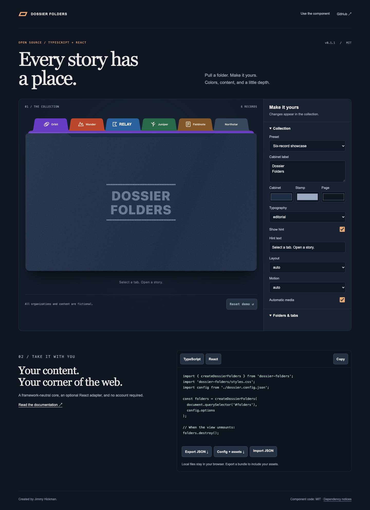

# Dossier Folders


A tactile, accessible folder interface for stories, projects, and collections.
Framework-neutral TypeScript, an optional React adapter, and a visual/content editor.

[Live demo](https://hickman.biz/portfolio/dossier-folders) · [API](docs/API.md) · [Customization](docs/CUSTOMIZATION.md) · [Validation](docs/VALIDATION.md)



## Run locally

Use Node **22.18+** and npm. No secrets, sibling checkout, or private registry is required.

```sh
git clone https://github.com/JimmyJammed/dossier-folders-web.git
cd dossier-folders-web
npm ci
npm run dev
```

Open the URL printed by Vite. The demo includes six fictional records, text and logo
tabs, images, videos, galleries, timelines, rich text, and configurable colors.
All sample assets are included. Asset regeneration is optional and requires ffmpeg
plus Playwright Chromium (`npx playwright install chromium`).

## Use the component

Download `dossier-folders-0.1.1.tgz` from the [GitHub release](https://github.com/JimmyJammed/dossier-folders-web/releases/tag/v0.1.1), or run `npm run pack:library`.
Public npm publication is deferred; the badge above is the repository version.

```sh
npm install ./dossier-folders-0.1.1.tgz
```

```ts
import { createDossierFolders } from 'dossier-folders';
import 'dossier-folders/styles.css';

const folders = createDossierFolders(document.querySelector('#folders')!, {
  records: [{
    id: 'notes', title: 'Field notes', fill: '#37475c', ink: '#fff5e7',
    tab: { mode: 'text', label: 'Notes' },
    blocks: [{ kind: 'text', paragraphs: ['A place for a good idea.'] }],
  }],
});
// When the host view unmounts:
folders.destroy();
```

React 18 and 19: import `DossierFolders` from `dossier-folders/react`, pass the same
`options`, and import the stylesheet once. React is not required for vanilla use.

## Documentation

- [Getting started](docs/GETTING_STARTED.md)
- [API and content types](docs/API.md)
- [Customization and exports](docs/CUSTOMIZATION.md)
- [Accessibility](docs/ACCESSIBILITY.md)
- [Architecture and extraction](docs/ARCHITECTURE.md)
- [Deployment](docs/DEPLOYMENT.md)
- [Testing and actual results](docs/VALIDATION.md)
- [Troubleshooting](docs/TROUBLESHOOTING.md)
- [Contributing](CONTRIBUTING.md)
- [Changelog](CHANGELOG.md)

## License

Original component code and fictional demo assets are MIT licensed. Created by
Jimmy Hickman. Copyright Falcon Forged Ventures LLC. Dependencies retain their
own licenses, including GSAP's separate license. See [LICENSE](LICENSE) and
[third-party notices](THIRD_PARTY_LICENSES.md). All demo organizations and content
are fictional. Uploaded assets remain local and retain their owners' rights.
